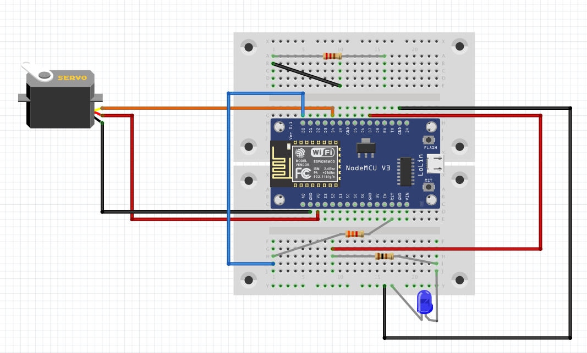

# Baromètre de la parité en temps réel

### Mentions dans les articles
**[parser-stories.py](parser-stories.py)**: repère les noms propres grâce à Spacy, leur attribue un genre.

Développement possible: utiliser Wikidata pour obtenir le genre des personnalités.

### Auteurs d’opinions
**[parser-opinions.py](parser-opinions.py)**: compte le genre des auteurs d’opinions écrites par la rédaction (éditoriaux, chroniques)et par des contributeurs externes (pages débats).

### Base de données sqlite

**[create-database.py](create-database.py)**: crée deux tables, une pour les mentions dans les articles, une autre pour les signatures d’opinions.

### Baromètre électronique

**[paritometre_sketch.ino](paritometre_sketch.ino)**: sketch pour animer un baromètre «en dur» constitué d’une carte électronique avec puce Wi-Fi, d’une planche et d’une aiguille. Le premier prototype, beaucoup plus simple, [est disponible ici](https://github.com/palrogg/bieg).

**[Schéma électronique avec Fritzing](schema_electronique.fzz)**

Aperçu:

### Config

Editer le fichier **.dist.env** et le renommer .env
